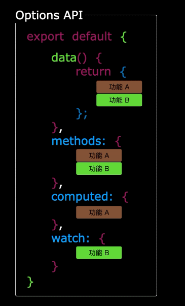
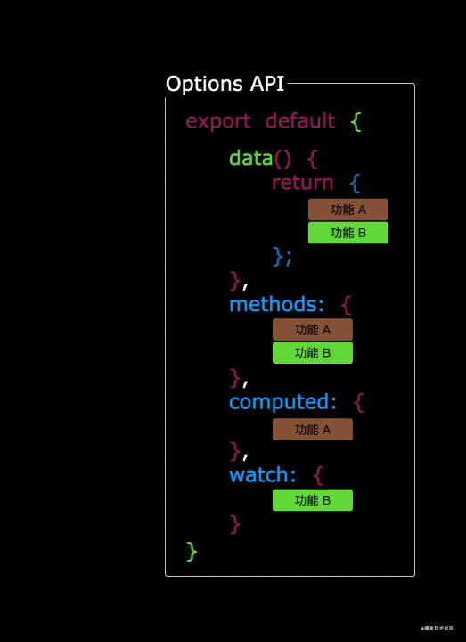
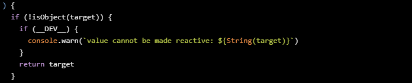

# day17-Composition-API

## 为什么要学习Composition-API

### Vue2.x

首先回顾下我们使用Option Api遇到的问题，我们在Vue2中常常会需要在特定的区域（data，methods，watch，computed...）编写负责相同功能的代码。

.

然后，我们来思考一下问题，随着业务复杂度越来越高，代码量会不断的加大；由于相关业务的代码需要遵循option的配置写到特定的区域，导致后续维护非常的复杂，代码可复用性也不高。

.

### Vue3.x中的Composition-API

显然我们可以更加优雅的组织我们的代码，函数。让相关功能的代码更加有序的组织在一起

.

所以优势就很明显啦！！！！！！！

.

### 总结

  1.首先Composition API是根据逻辑相关性组织代码的，这样可以提高代码的可读性和可维护性。
  2.这种方式可以更好地重用逻辑代码。比如，在Vue2中如果想重用逻辑代码，可能会发生命名冲突，以及关系不清。
  3.在Vue3中，Composition API是可选的，并不是一定要使用这种新方式，也就是说我们依然可以使用以前的结构和用法。
  4.可以确定的是Vue3.0是兼容Vue2.x版本的， 也就是说我们在日常工作中，可以是Vue3中使用Vue2.x的相关语法,但是当你真正开始使用Vue3写项目时，你会发现他比Vue2.x方便的多

## setup

### setup概述

  1.setup函数是Vue3中新增的函数，它是我们在编写组件时，使用Composition API(组合API)的入口。
  2.setup函数是处于生命周期函数beforeCreate和Created两个钩子函数之间的函数，也就是说在setup函数中是无法使用data和methods中的数据和方法的
  3.在setup函数中定义的变量和方法最后都是需要return出去的，不然无法在模板中使用

### setup的使用

* 1.setup函数是Composition API(组合API)的入口
* 2.将 props 作为第一个参数，而不是包含在上下文中
  * 2.1 组件使用 props 的场景更多，有时候甚至只使用 props
  * 2.2 将 props 独立出来作为第一个参数，可以让 TypeScript 对 props 单独做类型推导，不会和上下文中的其他属性相混淆。这也使得 setup 、 render 和其他使用了 TSX 的函数式组件的签名保持一致。*
* 3.将context作为第二个参数,从原来 2.x 中 this 选择性地暴露了一些 property
  * 3.1 attrs
  * 3.2 slots
  * 3.3 emit

```js
<script>
export default {
  name: 'App',
  setup(props,context){
    // 该函数接收 props 作为其第一个参数
    console.log(props);
    // 第二个参数提供了一个上下文对象(context)，从原来 2.x 中 this 选择性地暴露了一些 property。
    console.log(context);
  }
}
</script>
```

### setup函数的注意点

  1.由于我们不能在setup函数中使用data和methods，所以vue为了避免我们错误的使用，直接将setup函数中的this修改成了undefined
  2.setup函数只能是同步的不能是异步的

## 响应式系统API

### ref

接受一个参数值并返回一个响应式且可改变的 ref 对象。ref 对象拥有一个指向内部值的单一属性 .value。
此时需要注意的是，这个参数并不会返回一个值，而是一个响应式对象。而通过return返回的对象中的属性，就都可以在模板中使用了
**注意:ref函数只能监听简单类型的变化，不能监听复杂类型的变化，比如对象和数组**

```html
<template>
  <div class="container">
    <div class="box">
      <h2>声明响应式简单变量:</h2>
      <!-- 在模板中使用 -->
      <p>{{num}}</p>
    </div>
  </div>
</template>

<script>
// 引入声明响应式复杂对象的方法 reactive
import { ref } from "vue";

export default {
  name: "App",
  setup() {
    let num = ref(345);
    // 在setup中使用
    console.log(num.value);
    return {
      num
    };
  },
};
</script>
```

### reactive

reactive 基本等价于2.x中的Vue.observable()，返回一个响应式对象，就像2.x中定义在data选项里的数据一样，最终都会被转换成响应式对象。基于 ES2015 的 Proxy 实现

此时需要注意的是，这个参数并不会返回一个值，而是一个响应式对象。而通过return返回的对象中的属性，就都可以在模板中使用了

**注意: reactive参数必须是对象（json / arr），否则无法实现响应式。**

```js
  <script>
// 引入声明响应式复杂对象的方法 reactive
import { reactive } from "vue";

export default {
  name: "App",
  setup() {
    // 声明复杂数据数据
    let star = reactive({
      name: "于文文",
      age: 26,
      married: false,
    });
    return {
      star
    };
  },
};
</script>
```

如果声明非对象或非数组,无法实现响应式

```html
<template>
  <div class="container">
    <div class="box">
      <h2>声明响应式复杂变量:</h2>
      <p @click="changeState">{{state}}</p>
    </div>
  </div>
</template>

<script>
// 引入声明响应式复杂对象的方法 reactive
import { reactive } from "vue";

export default {
  name: "App",
  setup() {
    // 声明复杂数据数据
    let state = reactive(123);
    // 点击元素 改变state的值
    function changeState(){
      state = 666;
      console.log(state);
    }
    return {
      state,
      changeState
    };
  },
};
</script>
```

.

### computed

传入一个拥有 get 和 set 函数的对象，创建一个可手动修改的计算状态。

```html
<template>
  <div @click="changeVal">{{ addOne }}</div>
</template>

<script>
// 引入composition API
import { computed, ref } from "vue";

export default {
  name: "vComputed",
  setup() {
    //#region  传入一个拥有get和set函数的对象
    const count = ref(1);
    const addOne = computed({
      get: () => count.value + 1,
      set: val => {
        count.value = val - 1;
        console.log(count.value);
      }
    });

    function changeVal() {
      addOne.value = 6;
    }
    //#endregion

    return {
      addOne,
      changeVal
    };
  }
};
</script>

```

### readonly

  传入一个对象（响应式或普通）或 ref，返回一个原始对象的只读代理。只读代理是“深只读”，对象内部任何嵌套的属性也都是只读的。

  ```js
const original = reactive({ count: 0 })

const copy = readonly(original)

// original 上的修改会触发 copy 上的侦听
original.count++

// 无法修改 copy 并会被警告
copy.count++ // warning! 
  ```

### watchEffect

### watch

## 生命周期钩子函数

## 依赖注入

## 模板Refs

## 响应式系统工具集

### unref

### toRef

### toRefs

### isRef

### isProxy

### isReactive

### isReadonly

## 高级响应式系统API

### customRef

### markRaw

### shallowReactive

### shallowRef

### shallowReadonly

### toRaw

## 参考资料

> [Vue 组合式 API](https://vue3js.cn/vue-composition-api/#watch)
> [Vue3实战系列：结合 Ant-Design-of-Vue 实践 Composition API](https://juejin.im/post/6882393804310052871)
> [Vue3 - Composition API](https://blog.csdn.net/weixin_47521346/article/details/109185232)
> [Vue3 Composition API](https://blog.csdn.net/qq_45613931/article/details/109471110)
> [Vue3.0 学习相关](https://github.com/newbee-ltd/vue3-examples)
